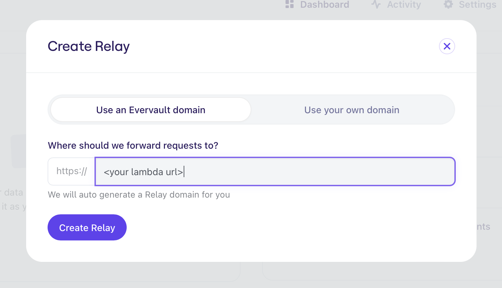

# Multi Cage Example
[Evervault](https://evervault.com) makes it easy to encrypt data at source, process it in a Cage — a secure, serverless function — and never store it unencrypted.

This example will show you how to have multiple cages in a single github repository.

## Setup

First of all, make a fork of this repository in your own github account.
Navigate to the Evervault dashboard and open the menu to create a new cage.
Choose to import the cage from a github repository and enter the link to the fork that you made.
Then, select the checkbox 'Include from subdirectory'.
Enter `cages/check-entitlements`.


Do the same thing for `cages/validate-user-credentials`.
You now have two cages which are derived from a single git repository.

## Deployment

We will create a lambda instance which will obtain encrypted information from Relay and perform operations on it using the cages we made in the previous step.

We will be using [serverless](https://www.serverless.com) to deploy the lambda.
For this to work, you will need to have to setup the AWS CLI.
For information on doing that, see [here](https://docs.aws.amazon.com/cli/latest/userguide/cli-chap-configure.html).

Once you that setup, create a `.env` file in the `serers/nodejs/` and fill it with the environment variables: `EVERVAULT_API_KEY`, `CHECK_ENTITLEMENTS_CAGE` and `VALIDATE_USER_CREDENTIALS_CAGE`. The syntax is simply `VARIABLE=VALUE`.

```sh
cd servers/nodejs/
npm install
npx serverless deploy
```

If this works, you should see output simlar to the output below.

```
output...
Serverless: Packaging service...
Serverless: Excluding development dependencies...
Serverless: Creating Stack...
Serverless: Checking Stack create progress...
........
Serverless: Stack create finished...
Serverless: Ensuring that deployment bucket exists
Serverless: Uploading CloudFormation file to S3...
Serverless: Uploading artifacts...
Serverless: Uploading service multi-cage-example.zip file to S3 (39.07 MB)...
Serverless: Validating template...
Serverless: Updating Stack...
Serverless: Checking Stack update progress...
..................................................................
Serverless: Stack update finished...
Service Information
service: multi-cage-example
stage: dev
region: <region>
stack: multi-cage-example-dev
resources: 23
api keys:
  None
endpoints:
  POST - <lambda url>/
functions:
  handler: multi-cage-example-dev-handler
layers:
  None
```

We will now create a Relay instance pointing to this lambda.
We will send data to this relay rather than directly to the server so that plaintext data never touches our server.
To do so, navigate to the Evervault dashboard and create a relay which points to the url of your lambda.



Specify the fields to encrypt as `email`, `number`, `age`, `ailments` and `entitlements`.

## The NodeJS Server


In the server, we initialise an Evervault client using our team's API key.

```js
const evervault = new Evervault(process.env.EVERVAULT_API_KEY, {intercept: true})
```

The intercept option indicates that all traffic will be routed through Relay.
By default, this means that all outbound traffic will be decrypted by Relay ([learn more](https://docs.evervault.com/concepts/relay/response-encryption)).

We run a cage as follows.

```js
await evervault.run(<cage name>, <body>);
```

The cage name can be obtained from the dashboard.

## Invocation Using the Server

The server will receive encrypted data from Relay.
It will send the encrypted data to the appropriate Cage, where it will be decrypted and processed.
The Cage will return encrypted data to the server, and the server will send a response to the client via Relay.

### Entitlement Calculation Cage

If you invoke the server as follows:

```sh
curl <your relay url> \
-X POST \
-H 'content-type: application/json' \
--data '{"action":"check-entitlements", "age":35, "ailments":["diabetes"]}'
```

You should see the result:

```json
{
	"error": false,
	"result": {
		"entitlement" : 250000
	}
}
```

### User Validation Cage

If you invoke the server as follows:

```sh
curl <your relay url> \
-X POST
-H 'content-type: application/json' \
--data '{"action":"validate-user-credentials", "email":"user@mail.com", "phone":"+1 (415) 223-8720"}'
```

You should see the result:

```json
{
	"error": false
}
```

Cool! Now you know how to include multiple cages in a single github repository!

## Configuration

We can modify the `cage.toml` file in a cage's root directory to customise how it is run.

For example, we could use the `timeout` directive to indicate the amount of time the cage is allowed to live for.
The default value is 30 seconds.
Add this directive to the `cage.toml` file of the `check-entitlements` cage to indicate that it should be allowed to live for a minute.

```toml
[cage]
timeout=60
```

When you push this change to your repository, the cage will automaticaly updated.

To learn more about the `cage.toml` file, see [here](https://docs.evervault.com/reference/cagetoml).


---

If you want to know more about Evervault, check out our [documentation](https://docs.evervault.com).
